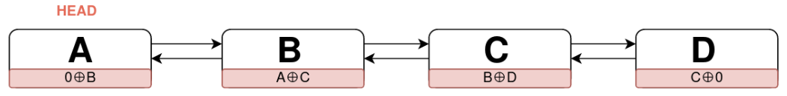
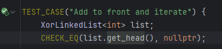
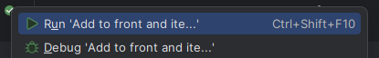
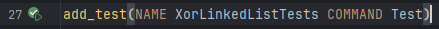
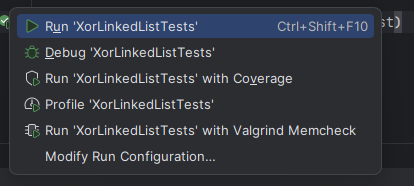
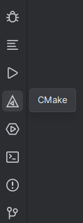
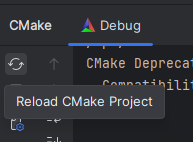

[](https://classroom.github.com/a/4gI4ENGs)
# Homework 1: XOR Linked List Implementation

**Course:** Data Structures and Algorithms  
**Due Date:** *April 8th, 2025 by 23:59*  

## Objective
In this assignment, you will implement a **memory-efficient doubly linked list** using **XOR-linked lists**. This approach saves memory by using a **single pointer per node**, instead of storing both `next` and `prev` pointers.



## Task Description
Here are some of the main considerations regarding the homework.

### 1. **Node Structure**
- Each node should store a *templated* `data` member and a special `both` pointer.
- `both` should store the **XOR** of the addresses of the *previous* and *next* nodes.
- The `Node` struct has already been implemented for you.

### 2. **XorLinkedList Class**
Implement the following methods:
- `void add_to_front(const Data& data)`: Inserts a new node at the **front** of the list.
- `void add_to_back(const Data& data)`: Inserts a new node at the **end** of the list.
- `void remove_from_front()`: Removes the first node.
- `void remove_from_back()`: Removes the last node.
- `Data& get(int index)`: Returns the element at the specified index (0-based).
- `int count() const`: Returns the number of elements in the list.
- `void reverse()`: Reverses the list.
- **Iterators:** Implement an iterator to traverse the list using `begin()` and `end()`.
- **Copy and Move Semantics:**
    - Implement the **copy constructor** and **copy assignment operator**.
    - Implement the **move constructor** and **move assignment operator**.
- _initializer list_ constructor
- `operator[]`: _Overload_ the `[]` operator to allow index-like accessing of elements in the list

### 3. **Helper Functions**
- The function `Node<Data>* ptr_xor(Node<Data>* a, Node<Data>* b)` has been already implemented for you, which computes `a ⊕ b` using pointer arithmetic.
    ```c++
    // Example:
    Node<Data>* a;
    Node<Data>* b;
    Node<Data>* c = ptr_xor(a, b); // c now holds the XOR of a's and b's address
    ```
- The `Node<Data>* get_head()` function is necessary for running tests, so do not remove it.

## Implementation Constraints
- Do **not** use `std::vector`, `std::list`, or any standard library linked list implementations.
- The list must be implemented **using only one pointer per node** (XOR-based traversal).
- The class must support **dynamic memory management** (allocation and deallocation).
- Implement **exception handling** for cases like accessing out-of-bounds indices, or trying to remove data from empty lists.

## Running the Tests
To verify the correctness of your implementation, you can run the **unit tests** that come with this repository.

You have two ways to run tests.

1. You can run each test _individually_ by clicking on the "Run" button next to the `TEST_CASE` keywords in the `test/tests.cpp` file.

    
    

    There are 11 tests in total, so running each one individually might become tedious, but it is a good way to test out each individual piece of functionality.
2. You can run _all tests at once_ by clicking on the "Run" button next to the `add_test` command in the `CMakeLists.txt` file.

   
   

### Q/A: I cannot see the "Run" icon.
If you cannot see the "Run" icon (green play button) for whatever reason next to your tests, the most likely explanation is that your project is _not properly built_.

To re-build your project, click on the `CMake` icon (a triangle with another triangle in it) in the _bottom-left sidebar_ of CLion, followed by `Reload CMake Project`.

 


After the project is reloaded, you should be able to run your tests (you might need to close and re-open the test file).

If you still cannot run the tests, contact the course professor.

---
https://ibu.edu.ba 
